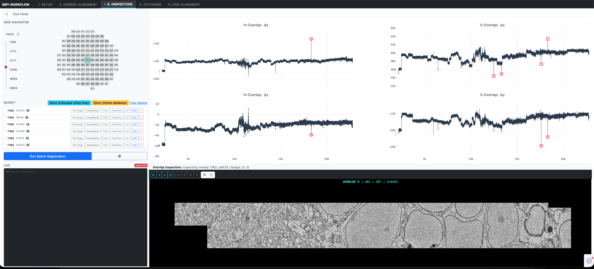

# em_inspection

[](https://github.com/ganctom/em_inspection/actions/workflows/test.yml)
[](https://ganctom.github.io/em_inspection/)
[](https://opensource.org/licenses/MIT)

A Python application and interactive web dashboard for inspection, coarse offset curation, and non-rigid stitching of **Serial Block-Face Electron Microscopy (SBEM)** datasets.



---

## Overview & Scientific Integrations

- **SBEMimage Integration**: Raw acquisition parsing and section indexing primarily supports datasets acquired with [**SBEMimage**](https://github.com/SBEMimage/SBEMimage), an open-source acquisition software package for serial block-face scanning electron microscopy.
- **Powered by Google Research SOFIMA**: High-throughput 2D mesh relaxation, fine optical flow estimation, and non-rigid elastic section warping heavily build upon the [**SOFIMA**](https://github.com/google-research/sofima) (Scalable Optical Flow-based Image Mosaic and Alignment) library developed by Google Research.
- **Interactive Dash Dashboard**: Rapid visual inspection of stage drift curves across tens of thousands of sections, dual-tile ultrastructure seam verification, box selection of outliers, and manual sub-pixel vector nudging.
- **Author's Coarse Offset Refinement**: Features a custom overlap-evaluation registration method that refines coarse offset vectors both for individual tile pairs and in high-throughput batch mode.
- **Embedded DuckDB Spatial Database**: Ultra-fast relational registry storing and querying millions of coarse offset coordinates with atomic scratch compilation.
- **Pixi Managed Environment**: Fast, reproducible Conda & PyPI dependency management via [Pixi](https://pixi.sh).

---

## Quick Start

### Prerequisites

Install `pixi` (if you haven't already):
```bash
curl -fsSL https://pixi.sh/install.sh | bash
```

### Installation

Clone the repository and install dependencies automatically:
```bash
git clone https://github.com/ganctom/em_inspection.git
cd em_inspection
pixi install
```

### Launching the Interactive Inspector

Run the Dash application locally:
```bash
pixi run python src/em_inspection/interactive_inspector/index.py
```
Then navigate to `http://localhost:8050` in your web browser.

### Running Tests

Run the test suite using `pixi`:
```bash
pixi run test
```

### Serving Documentation Locally

Serve the MkDocs documentation site:
```bash
pixi run docs-serve
```
View the documentation at `http://127.0.0.1:8000`.

---

## Documentation

For full guides, architecture concepts, workflow tutorials, and configuration references, visit our online documentation:
**[https://ganctom.github.io/em_inspection/](https://ganctom.github.io/em_inspection/)**

---

## References & Acknowledgments

- **SOFIMA**: Michal Januszewski & Jörgen Kornfeld, *Scalable optical flow-based image mosaic and alignment*, [Google Research](https://github.com/google-research/sofima).
- **SBEMimage**: Benjamin Titze et al., *SBEMimage: Open-source acquisition software for serial block-face electron microscopy*, [SBEMimage Repository](https://github.com/SBEMimage/SBEMimage).

---

## License

This project is licensed under the [MIT License](LICENSE).
