# Pipeline Overview & Architecture

Serial Block-Face Scanning Electron Microscopy (SBEM) combines iterative diamond-knife microtomy with in-situ SEM imaging to capture large volumes of biological tissue at nanometer scale. Achieving high-precision 3D reconstructions from raw SBEM acquisitions requires addressing physical, optical, and computational challenges.

---

## Scientific Context & Core Software Integrations

To ensure high performance and reproducibility, `em_inspection` bridges standard acquisition software with state-of-the-art alignment libraries:

- **SBEMimage Integration**: Raw dataset parsing and coordinate indexing are primarily designed for datasets acquired with [**SBEMimage**](https://github.com/SBEMimage/SBEMimage), the established open-source microscope control software for serial block-face imaging.
- **Google Research SOFIMA**: High-throughput 2D mesh relaxation, fine optical flow estimation, and non-rigid elastic section warping heavily utilize the [**SOFIMA**](https://github.com/google-research/sofima) (Scalable Optical Flow-based Image Montaging and Alignment) library developed by Google Research (Januszewski et al., 2024).
- **Author's Coarse Offset Refinement**: Features a custom overlap-evaluation registration method that evaluates overlap consistency across candidate displacement grids to refine coarse offsets individually or in batch.

---

## Physical Dynamics of SBEM Acquisitions

Unlike transmission electron microscopy of single-section ribbons or FIB-SEM milling, SBEM datasets present unique mechanical and physical artifacts:

1. **Stage Drift & Piezo Hysteresis**: Physical motorized stages exhibit slight thermal expansion and mechanical hysteresis. A nominal overlap of $10\%$ between adjacent tiles can physically fluctuate between $5\%$ and $15\%$ over a 48-hour acquisition run.
2. **Specimen Charging & Local Beam Distortion**: Biological tissue embedded in non-conductive epoxy resins accumulates negative electrical charge under the primary electron beam. Charge dissipation varies across resin borders, cell membranes, and high-stain organelle clusters, leading to local scan line deflections and shear.
3. **Diamond Knife Cutting Dynamics**: The knife cuts across the block surface with high mechanical shear stress. Dull knives or micro-nicks create longitudinal knife stripes, Chatter marks (periodic thickness variations), and localized non-linear tissue compression along the cutting direction.
4. **Resin Margin Non-Uniformity**: Sections bordered by pure embedding resin lack ultrastructural texture. In these regions, standard intensity-based cross-correlation can fail or latch onto spurious noise patterns.

---

## The Multi-Stage Alignment Hierarchy

To handle these physical phenomena robustly across multi-terabyte datasets, `em_inspection` separates the reconstruction problem into five decoupled stages:

```mermaid
flowchart TD
    subgraph S1["Stage 1: Ingestion & Validation (SBEMimage)"]
        A1["Raw Tile Folders<br/>(sXXXXX_gYYYY)"] --> A2["Acquisition Validator"]
        A2 --> A3["Missing Section Check<br/>& Tile Map Verification"]
        A3 --> A4["Experiment Registry<br/>(experiments.yaml)"]
    end

    subgraph S2["Stage 2: Coarse Shift Estimation"]
        A4 --> B1["Tile Overlap Pairs<br/>(Horizontal & Vertical)"]
        B1 --> B2["CLAHE & Bandpass Filtering"]
        B2 --> B3["Normalized Cross-Correlation<br/>(Peak Detection)"]
        B3 --> B4["DuckDB Spatial Database<br/>(coarse_offsets.db)"]
    end

    subgraph S3["Stage 3: Interactive Curation & Refinement"]
        B4 --> C1["Quad Drift Plots (Δx, Δy vs Z)"]
        C1 --> C2["Rectangle / Box Multi-Selection"]
        C2 --> C3["Shopping Basket Curation"]
        C3 --> C4["Visual Dual-Tile Seam Inspection"]
        C4 --> C5["Author's Refinement Method<br/>& Sub-pixel Manual Nudging"]
        C5 --> C6["Atomic Export<br/>(cx_cy.json / DuckDB)"]
    end

    subgraph S4["Stage 4: 2D Non-Rigid Elastic Stitching (SOFIMA)"]
        C6 --> D1["Coarse Spring Mesh Relaxation"]
        D1 --> D2["Fine Patch Optical Flow"]
        D2 --> D3["Regularized Elastic Fine Mesh"]
        D3 --> D4["Section Warping with Margin Masking"]
        D4 --> D5["Multi-Scale Downscaling<br/>(Overview Thumbnails)"]
    end

    subgraph S5["Stage 5: 3D Inter-Section Alignment (Roadmap)"]
        D5 --> E1["Consecutive Section Flow Fields"]
        E1 --> E2["Multi-Section Elastic Regularization"]
        E2 --> E3["Unified Isotropic 3D Volume<br/>(OME-Zarr / Neuroglancer)"]
    end
```

---

## Detailed Processing Stages

### 1. Ingestion & Validation
The pipeline discovers and indexes directory structures produced by [**SBEMimage**](https://github.com/SBEMimage/SBEMimage) acquisitions. It indexes all sections and tile coordinate maps, automatically flagging:
- Gaps in the continuous physical section sequence (`missing_sections.yaml`).
- Corrupt or partially written tile coordinate definitions (`invalid_tile_id_maps.yaml`).

### 2. Coarse Shift Estimation
Nominal stage coordinates cannot guarantee sub-pixel or even pixel-level alignment. For every adjacent tile pair in the horizontal ($H$) and vertical ($V$) directions:
- Contrast is standardized using **Contrast Limited Adaptive Histogram Equalization (CLAHE)**.
- Normalized cross-correlation identifies the global translational offset $(\Delta x, \Delta y)$ within a bounded search window.
- The results are compiled into an embedded **DuckDB** database (`coarse_offsets.db`), indexing millions of offset vectors for millisecond query performance.

### 3. Interactive Curation & Refinement
Automated algorithms occasionally produce suboptimal offsets in low-texture areas (such as large blood vessel lumens, cell bodies with homogeneous nucleoplasm, or resin edges). The interactive dashboard provides:
- Four synchronous **Drift Curves** displaying $\Delta x$ and $\Delta y$ across thousands of sections.
- **Rectangle / Box Multi-Selection** to select groups of outlier points directly from the plot canvas into the curation basket.
- **Author's Overlap-Evaluation Refinement**: A custom coarse offset optimization algorithm (`refine_coarse_offset_eval_ov`) evaluating overlap image consistency across candidate displacement grids to automatically recompute shifts for individual tile pairs or across entire baskets in batch mode.
- A high-resolution **Overlap Viewer** allowing the microscopist to visually inspect ultrastructure alignment across tile seams.
- Sub-pixel **Manual Nudging** via keyboard arrow keys for fine interactive adjustments.

### 4. High-Throughput 2D Non-Rigid Stitching
With verified coarse offsets, the pipeline executes the Google Research **SOFIMA** (Scalable Optical Flow-based Image Mosaic and Alignment) workflow:
- **Coarse Mesh Relaxation**: A 2D spring-mass mesh initializes global tile positions, resolving cumulative overlap tensions.
- **Dense Optical Flow**: High-frequency deformation fields are calculated using patch-based block matching across tile overlaps.
- **Fine Mesh Regularization**: Elastic springs regularize local flow vectors, preventing non-physical fold-overs or shear tearing.
- **Section Warping with Margin Masking**: Raw tile pixels are interpolated into a continuous 2D section mosaic. Margin masking is applied specifically during this warping step to mask out non-overlapping resin margins and eliminate boundary artifacts without interfering with flow computation or mesh relaxation.
- **Multi-Scale Downscaling**: Generates downscaled overview images for rapid slice verification and pyramidal storage.

### 5. 3D Inter-Section Alignment (Roadmap)
Once all sections are stitched into 2D mosaics, cross-section optical flow is computed across consecutive $Z$-cuts. Multi-section spring relaxation models physical knife compression and drift across the volume, producing an aligned 3D dataset ready for segmentation and visualization.

---

## References

- **SOFIMA**: Januszewski, M., Blakely, T., & Lueckmann, J.-M. (2024). *SOFIMA: Scalable Optical Flow-based Image Montaging and Alignment* [Computer software]. Zenodo. [https://doi.org/10.5281/zenodo.10534541](https://doi.org/10.5281/zenodo.10534541) / [GitHub](https://github.com/google-research/sofima).
- **SBEMimage**: Benjamin Titze et al., *SBEMimage: Open-source acquisition software for serial block-face electron microscopy*, [SBEMimage Repository](https://github.com/SBEMimage/SBEMimage).
