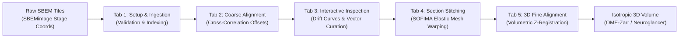

# em_inspection

**em_inspection** is a specialized high-performance toolkit and interactive dashboard for the quality control, coarse offset curation, and non-rigid stitching of massive **Serial Block-Face Electron Microscopy (SBEM / SBF-SEM)** datasets.

---

## Scientific Context & Core Integrations

Acquisition of serial block-face datasets generates thousands of consecutive section cuts, tens of thousands of tiles, and terabytes of imaging data. Over multi-day acquisitions, physical stage drift, charging deflections, and mechanical microtome variations create discrepancies between physical microscope stage coordinates and actual tile overlaps.

- **SBEMimage Compatibility**: The dataset ingestion and parsing pipeline is tailored specifically for datasets acquired with [**SBEMimage**](https://github.com/SBEMimage/SBEMimage), the widely used open-source acquisition system for serial block-face scanning electron microscopy.
- **Google Research SOFIMA**: Global 2D mesh relaxation, fine optical flow estimation, and non-rigid section warping heavily utilize the [**SOFIMA**](https://github.com/google-research/sofima) (Scalable Optical Flow-based Image Mosaic and Alignment) library developed by Google Research.
- **Author's Coarse Offset Refinement**: Features a custom overlap-evaluation registration algorithm that refines coarse offset vectors across candidate shift grids, available both for individual tile seams and across large multi-section batches.

---

## Core Capabilities

- **Interactive Dash Web GUI**: Modern, reactive web dashboard designed for fluid navigation across thousands of sections.
- **Embedded DuckDB Spatial Registry**: Ultra-fast relational storage and querying of millions of coarse offset vectors with atomic scratch compilation.
- **Interactive Drift Curves & Multi-Selection**: High-speed Plotly visualization of horizontal and vertical overlap shifts ($\Delta x, \Delta y$), supporting box/rectangle selection to stage groups of outliers into the curation basket.
- **Micro-Adjustment & Overlap Curation**: Dual-tile ultrastructural overlay viewer with sub-pixel keyboard nudging (`w`/`s` slice stepping, arrow keys for vector shifting).
- **Author's Overlap-Evaluation Refinement**: Specialized optimization method that evaluates overlap image consistency across candidate displacement grids to refine coarse offsets individually or in batch.
- **SOFIMA Elastic Mesh Integration**: Seamless 2D non-rigid tile stitching utilizing Google Research SOFIMA elastic spring relaxation and dense optical flow.
- **Reproducible Pixi Environment**: Cross-platform Conda and PyPI dependency management with out-of-the-box Apple Silicon (Metal) and Linux x86_64 support.

---

## Documentation Structure

- [**Installation Guide**](installation.md): Environment setup, prerequisites, and dependencies via Pixi.
- [**Pipeline Concepts**](concepts/pipeline_overview.md):
    - [Overview & Architecture](concepts/pipeline_overview.md): Physical EM dynamics, SBEMimage support, SOFIMA integration, and multi-stage alignment hierarchy.
    - [Data Models & Storage](concepts/data_structures.md): SBEM directory structures, DuckDB schema, and config specifications.
- [**Workflow Guide**](workflow/01_setup.md):
    - [1. Setup & Project Ingestion](workflow/01_setup.md): Project initialization and dataset validation for SBEMimage acquisitions.
    - [2. Coarse Offset Estimation](workflow/02_coarse_alignment.md): Cross-correlation calculation across section overlaps.
    - [3. Interactive Inspection & Curation](workflow/03_inspection.md): Drift visualization, box selection, author's coarse refinement, and manual nudging.
    - [4. Section Stitching & Warping](workflow/04_stitching.md): Elastic spring mesh relaxation, fine flows, margin masking, and parallel warping.
    - [5. Section Fine-Alignment (Roadmap)](workflow/05_fine_alignment.md): Conceptual overview of 3D volumetric $Z$-registration.
- [**Reference**](reference/configuration.md):
    - [Configuration Parameters](reference/configuration.md): Complete reference for YAML settings and tuning thresholds.
    - [Operational Troubleshooting](reference/troubleshooting.md): Diagnostic decision tables for rapid issue resolution.

---

## References

- **SOFIMA**: Michal Januszewski & Jörgen Kornfeld, *Scalable optical flow-based image mosaic and alignment*, [Google Research](https://github.com/google-research/sofima).
- **SBEMimage**: Benjamin Titze et al., *SBEMimage: Open-source acquisition software for serial block-face electron microscopy*, [SBEMimage Repository](https://github.com/SBEMimage/SBEMimage).
