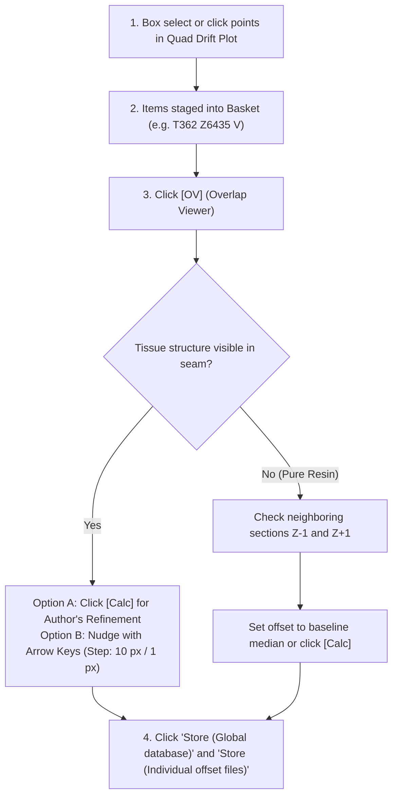

# Operational Troubleshooting Guide

This guide provides structured diagnostic decision tables to rapidly diagnose and resolve issues encountered during Serial Block-Face image processing in `em_inspection`.

---

## Quick Diagnostic Decision Matrix

| Observed Symptom | Underlying Cause | Diagnostic Check | Corrective Action |
| :--- | :--- | :--- | :--- |
| **Drift plot shows an isolated spike or anomalous departure from baseline.** | Cross-correlation locked onto untextured resin, a large blood vessel lumen, or knife marks. | In Tab 3, click the point or use the box selection tool to add points to the **Basket**, then click **`OV`** (Overlap Viewer). | 1. If featureless resin: set `min_range` higher (e.g., `[25, 45, 60]`). 2. If tissue is present: click **`[Calc]`** to run the Author's Overlap-Evaluation Refinement, or use arrow keys in the Overlap Viewer to manually nudge the seam, then click **`Store (Global database)`**. |
| **Drift curve exhibits a permanent vertical step (jump).** | Ultramicrotome knife was rotated or replaced, or microscope stage was manually recentered. | Check the section index where the jump occurs against the microscope run log. | Normal physical phenomenon. Verify that the offset immediately after the jump remains consistent across subsequent sections. |
| **"No experiment loaded" warning banner appears in Tab 3 or Tab 4.** | Active project session expired or application was refreshed without selecting an experiment. | Check the banner alert in the Dash web interface. | Navigate back to **`1. SETUP`**, select your project from the **Existing Experiments** dropdown, and click **`Initialize Project`**. |
| **Mesh integration fails or diverges during Step 4 (`coarse_mesh` / `fine_mesh`).** | Unfiltered gross outlier vectors or excessively high spring stiffness causing numerical instability. | Inspect terminal/console for `RuntimePipelineError` or infinite velocity alerts. | 1. In **Mesh Integration Config**, reduce `dt` (e.g. from `0.001` to `0.0005`) and increase damping `gamma` (e.g. to `0.1`). 2. Verify in Tab 3 that no extreme outlier shifts ($> 50\text{ px}$) were committed. |
| **Tile boundaries appear visible as dark/light seams in stitched images.** | Uneven illumination, detector gain falloff near tile edges, or unmasked scan margins. | Inspect raw tile borders using **`[Tile Image]`** in Tab 3. | 1. In **Masking Config**, increase `mask_margin` (e.g. `10 - 20 px`) and set `rim_size` to `40 - 60 px` (applied during section warping). 2. Enable `clahe` (`use_clahe: true`) during warping. |
| **Dense optical flow vectors point in random directions across overlap.** | Low tissue contrast or heavy beam charging causing feature degradation. | Click **`[Flow]`** and **`[CleanFlow]`** in the Tab 3 Basket. | 1. Increase `min_peak_ratio` (e.g. to `1.8`) to reject ambiguous matches. 2. Increase `patch_size` from `[120, 120]` to `[160, 160]` to encompass more structural context. |
| **Validator reports missing section directories during Step 1.** | Acquisition was paused, microtome advance failed, or files are still transferring from the microscope. | Check `<sbem_root_dir>/missing_sections.yaml`. | 1. If files are still transferring: wait for sync to complete and click **`Parse Experiment`** again. 2. If cuts were physically skipped: verify the missing list is accepted so downstream indices remain synchronized. |
| **DuckDB database locked or permission denied error on network volume.** | Concurrent write conflicts on SMB/NFS share or an abandoned lock file from a crashed worker. | Check console traceback mentioning `duckdb.IOException`. | 1. The pipeline automatically compiles DuckDB in local scratch space before moving to the volume. 2. Ensure only one user or process is writing to `coarse_offsets.db`. 3. Delete any stale `.db.tmp` or lock files left in `<proc_dir>/`. |

---

## Detailed Step-by-Step Resolution Procedures

### Procedure A: Resolving Drift Spikes & Seam Misalignments in Tab 3

When an overlap requires review or adjustment:

1. **Locate the Offsets**: In the Quad Drift Plots, inspect $\Delta x$ and $\Delta y$. Hover over suspect points to verify section numbers ($Z$) and tile IDs.
2. **Stage into Basket**: 
   - Use the **rectangle selection tool** to drag a box over clusters of suspect points, adding them all at once.
   - Or click directly on individual data points.
3. **Inspect the Seam**: Click the **`OV`** button on any staged item to open the Overlap Inspection Viewer.
4. **Evaluate Image Content & Refine**:
   - **Automated Refinement**: Click **`[Calc]`** (or use **`Run Batch Registration`** for all basket items) to run the Author's Overlap-Evaluation Refinement algorithm.
   - **Manual Nudging**: Use the keyboard arrow keys (<kbd>←</kbd>, <kbd>→</kbd>, <kbd>↑</kbd>, <kbd>↓</kbd>) to shift the active tile by configurable steps until fine subcellular structures (mitochondria, membranes) flow continuously.
5. **Commit the Correction**: Click **`Store (Global database)`** to persist the corrected shift into DuckDB, and click **`Store (Individual offset files)`** to update `cx_cy.json`.

---

### Procedure B: Stabilizing SOFIMA Mesh Relaxation in Step 4

If section stitching logs report `Mesh divergence` or warped sections display extreme local stretching:

1. **Verify Pre-conditions**: Ensure that coarse offsets for this section have been calculated and curated in Tab 3. A coarse offset that is off by $100\text{ px}$ can pull the elastic mesh into a tangled knot.
2. **Review Spring Parameters**: Open `tile_stitching_config.yaml` or edit the **Mesh & Warp** tab in Tab 2:
   - **Increase spring stiffness $k$**: Raising $k$ from `0.1` to `0.2` or `0.3` penalizes non-rigid deformations more heavily, keeping tiles closer to their rigid coarse positions.
   - **Increase damping $\gamma$**: Raising $\gamma$ from `0.05` to `0.1` absorbs kinetic oscillations faster.
   - **Decrease time step $\Delta t$**: Lowering `dt` from `0.001` to `0.0005` prevents numerical overshoot in steep gradient regions.
3. **Clean Flow Outliers**: In **Stitching Parameters**, reduce `max_deviation` (e.g. from `6` to `3`) and increase `min_peak_ratio` (e.g. from `1.6` to `1.8`) to aggressively discard noisy flow vectors before mesh integration.
4. **Re-run Sequential Mode**: Set execution mode to **Sequential** and run the target section individually to observe the step-by-step console feedback.
