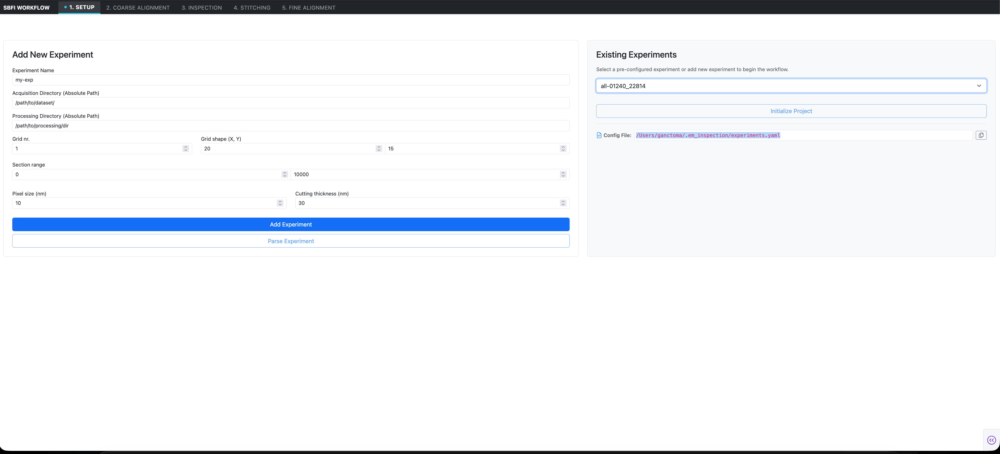

# 1. Setup & Project Ingestion

The **Setup** interface provides the entry point for configuring and ingesting Serial Block-Face EM datasets into the `em_inspection` pipeline. It registers dataset paths, sets spatial physical dimensions, and executes pre-flight validation routines to guarantee acquisition integrity before computationally intensive alignment begins.

> [!NOTE] SBEMimage Compatibility
> The dataset ingestion and folder structure parsing in `em_inspection` is designed specifically for datasets acquired with [**SBEMimage**](https://github.com/SBEMimage/SBEMimage), an open-source acquisition software package for serial block-face scanning electron microscopy.



---

## Interface Walkthrough

The Setup tab is split into two primary panels: **Add New Experiment** (left) and **Existing Experiments** (right).

### 1. Add New Experiment Panel

Use this panel to define a new imaging run or branch an existing dataset with custom parameters:

| Input Field | Format / Example | Description |
| :--- | :--- | :--- |
| **Experiment Name** | String (`my-exp` or `all-01240_22814`) | A unique project identifier used across all configuration files and database registries. |
| **Acquisition Directory** | Absolute filesystem path (`/Volumes/EM_DATA/exp_01/`) | The raw root folder containing the microscope acquisition outputs from SBEMimage (e.g., `sections/` and metadata). |
| **Processing Directory** | Absolute filesystem path (`/Volumes/SCRATCH/exp_01_proc/`) | The working directory where DuckDB registries, coarse offset JSONs, meshes, and warped Zarr volumes are saved. |
| **Grid nr.** | Integer (`1`) | The index of the imaging tile grid (e.g., `1` for `g0001`). Most acquisitions use a single primary grid. |
| **Grid shape (X, Y)** | Integer pair (`20`, `15`) | The total number of columns ($X$) and rows ($Y$) in the mosaic tile grid. |
| **Section range** | Integer range (`0` to `10000`) | The initial section cutting indices defining the volume boundaries ($Z_{first}$ to $Z_{last}$). |
| **Pixel size (nm)** | Float (`10.0`) | In-plane lateral pixel resolution in nanometers ($X-Y$). |
| **Cutting thickness (nm)** | Float (`30.0`) | Physical section cut thickness in nanometers ($Z$). |

#### Primary Actions

- **`Add Experiment`**: Validates the input form against the `ExpConfig` schema, formats cross-platform file paths, and appends the experiment entry to the persistent configuration store (`~/.em_inspection/experiments.yaml`).
- **`Parse Experiment`**: Triggers the background dataset parsing engine. The system scans the acquisition directory, parses the section directories (e.g., `s00000_g0001`), and extracts tile indexing maps.

---

### 2. Existing Experiments Panel

For previously configured datasets, the right-hand panel enables instant project loading:

- **Experiment Dropdown**: Displays all projects registered in `experiments.yaml`. Selecting an item automatically populates the form and prepares the application state.
- **`Initialize Project`**: Instantiates the active `DataService` context, verifies that the target processing directories exist, and connects to the experiment's DuckDB offset repository.
- **Config File Tracker**: Displays the absolute path to the active YAML registry (typically `~/.em_inspection/experiments.yaml`). A dedicated copy button allows you to quickly copy the path to the system clipboard for external editing or CLI automation.

---

## Pre-Flight Integrity Checks

When you click **Parse Experiment**, `em_inspection` runs automated validation checks to identify acquisition anomalies early:

> [!NOTE] Section Discontinuity Detection
> The validator checks section folders across the range $[Z_{first}, Z_{last}]$. Any detected missing section indices are stored in a dedicated file:
> ```yaml
> # <sbem_root_dir>/missing_sections.yaml
> - 412
> - 413
> - 1805
> ```
> Downstream steps automatically account for these missing indices to prevent indexing misalignment.

> [!WARNING] Tile Coordinate Map Verification
> The validator verifies each section's `tile_id_map.json`. Any sections with missing or incomplete tile mappings are recorded in:
> ```yaml
> # <sbem_root_dir>/invalid_tile_id_maps.yaml
> - "s04120_g0001"
> ```
> Flagged sections should be reviewed before proceeding to coarse offset calculations.

---

## Next Steps

Once the experiment is parsed and initialized, proceed to [**2. Coarse Alignment**](02_coarse_alignment.md) to calculate translational shift vectors across tile overlaps.
