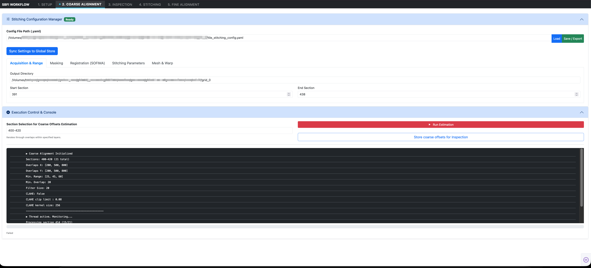

# 2. Coarse Offset Estimation

The **Coarse Alignment** tab computes the initial 2D translational displacement vectors ($\Delta x, \Delta y$) between adjacent overlapping tiles within each section. Because electron optical aberrations, motorized stage drift, and thermal expansion cause deviations from nominal coordinates, calculating these baseline offsets is essential prior to non-rigid mesh relaxation.



---

## Interface Walkthrough

The interface is structured into two primary functional components: the **Stitching Configuration Manager** (top) and the **Execution Control & Console** (bottom).

### 1. Stitching Configuration Manager

The top accordion manages all YAML parameter sets that govern registration, masking, and mesh integration:

- **Config File Path (.yaml)**: Specifies the active configuration file (e.g., `/Volumes/.../tile_stitching_config.yaml`).
- **`Load` & `Save / Export`**: Load pre-tuned parameters or export the current configuration back to disk.
- **`Sync Settings to Global Store`**: Commits edited values in the browser memory into the persistent application session state.

#### Parameter Categories (Sub-Tabs)

1. **Acquisition & Range**:
   - `Output Directory`: Path where section results and intermediate logs are stored.
   - `Start Section` & `End Section`: Boundary range defining the active processing subset (e.g. sections 391 to 438).
2. **Masking**:
   - `Mask Margin`: Trims unreliable tile periphery pixels (useful if lens shading or edge falloff is present).
   - `Rim Size`: Width of the border zone used for zero-weight falloff.
3. **Registration (SOFIMA)**:
   - `Overlaps X` / `Overlaps Y`: Array of candidate overlap pixel widths to evaluate during correlation searches (e.g., `[200, 500, 800]`).
   - `Min. Range`: Dynamic intensity range thresholds to filter out untextured resin regions.
   - `Min. Overlap`: Minimum physical overlap required between tiles in pixels.
   - `Filter Size`: Gaussian pre-filtering kernel size for noise suppression.
   - `CLAHE`: Enables Contrast Limited Adaptive Histogram Equalization with configurable `clip limit` and `kernel size`.
4. **Stitching Parameters**:
   - Governs patch sizes, peak correlation ratios, and cross-correlation sharpness criteria.
5. **Mesh & Warp**:
   - Convergence tolerances and physical spring constants for subsequent mesh relaxation.

---

### 2. Execution Control & Console

The execution panel configures the batch run and provides live telemetry from the calculation worker thread:

#### Section Selection Syntax

The **Section Selection for Coarse Offsets Estimation** field accepts flexible numeric ranges:

- **Contiguous Range**: `400-420` (processes all 21 sections between 400 and 420 inclusive)
- **Single Section**: `414`
- **Discontinuous List**: `400, 405, 410-420`

#### Action Buttons

- **`Run Estimation` (Red Button)**: Spawns a background worker thread that iterates across the selected sections. For each adjacent tile pair (both horizontal $H$ and vertical $V$ neighbors), the engine extracts the overlap ribbons, applies pre-filtering, and computes the 2D cross-correlation peak.
- **`Store coarse offsets for Inspection`**: Commits the computed shift vectors from memory into the central **DuckDB** repository (`coarse_offsets.db`). Once stored, the vectors become immediately available for plotting and inspection in Tab 3.

---

## Embedded Console Telemetry

During execution, the console displays real-time parameters and progress:

```text
► Coarse Alignment Initialized
Sections: 400-420 (21 total)
Overlaps X: [200, 500, 800]
Overlaps Y: [200, 500, 800]
Min. Range: [25, 45, 60]
Min. Overlap: 20
Filter Size: 20
CLAHE: False
CLAHE clip limit : 0.08
CLAHE kernel size: 256
---------------------------------------------
► Thread active. Monitoring...
Processing section 414 (15/21)
```

> [!TIP] Optimizing Search Speeds
> If your microscope stage is mechanically stable, narrow the `Overlaps X` and `Overlaps Y` ranges around your known nominal overlap (e.g., `[280, 300, 320]` instead of `[100, 300, 600]`). This drastically reduces the 2D Fourier transform space and accelerates calculation speed by $3\times$ to $5\times$.

---

## Next Steps

Once estimation finishes and offsets are committed, proceed to [**3. Inspection & Curation**](03_inspection.md) to inspect drift curves and verify overlap alignment.
