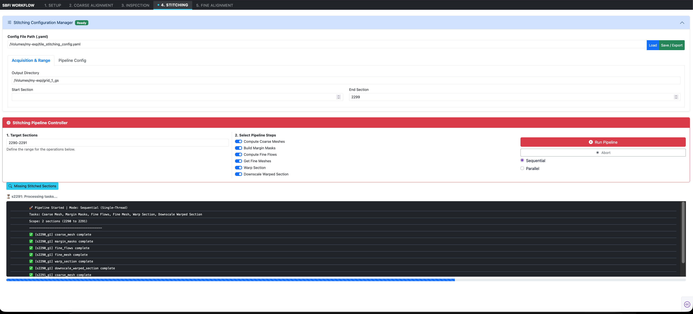

# 4. Section Stitching & Warping

The **Stitching** tab executes the non-rigid, elastic 2D assembly of individual microscope tiles into globally seamless section mosaics. Leveraging Google Research's [**SOFIMA**](https://github.com/google-research/sofima) (Scalable Optical Flow-based Image Mosaic and Alignment) library (Januszewski & Kornfeld), this phase compensates for local non-linear lens distortions, specimen charging shears, and residual stage inaccuracies.



---

## Interface Walkthrough

The Stitching interface provides centralized pipeline configuration and multi-stage task execution control:

### 1. Stitching Configuration Manager (Top Panel)

Displays the active configuration file and target paths:

- **Config File Path (.yaml)**: The path to the active configuration (e.g., `/Volumes/my-exp/tile_stitching_config.yaml`).
- **Acquisition & Range**:
  - `Output Directory`: Target directory where stitched section files, intermediate meshes, and downscaled representations are written (e.g., `/Volumes/my-exp/grid_1_gs/`).
  - `Start Section` & `End Section`: Physical boundary indices defining the active working dataset.
- **Pipeline Config**: Controls global downscaling factors (e.g., $0.3\times$ or $0.25\times$) for thumbnail generation and multi-scale pyramids.

---

### 2. Stitching Pipeline Controller (Bottom Panel)

The execution panel provides granular control over which mathematical stages are run on the target sections.

#### Target Section Selection
Specify individual sections or contiguous section blocks in the **Target Sections** input:
- `2290-2291`: Processes sections 2290 and 2291.
- `1000-1500`: Batch processes 501 consecutive sections.

#### The Six Modular Pipeline Steps

Each step can be toggled independently:


| Step Toggle | Task Key | Algorithmic Operation |
| :--- | :--- | :--- |
| **Compute Coarse Meshes** | `coarse_mesh` | Initializes a spring-mass network using curated translational offsets and relaxes the system to find the optimal global tile placement using SOFIMA. |
| **Build Margin Masks** | `margin_masks` | Generates edge-weighting and boundary masks. These masks are used downstream in the **Warp Section** step to eliminate resin boundaries and edge artifacts without interfering with coarse mesh relaxation or fine flow computation. |
| **Compute Fine Flows** | `fine_flows` | Computes dense block-matching optical flow fields across overlapping tile regions at patch resolution (e.g., $120 \times 120$ px). |
| **Get Fine Meshes** | `fine_mesh` | Solves a regularized elastic mesh optimization problem, balancing local optical flow match vectors against physical spring elasticity. |
| **Warp Section** | `warp_section` | Performs non-rigid coordinate transformation and spline interpolation, remapping raw tile pixels into a single 2D mosaic while applying margin masks. |
| **Downscale Warped Section** | `downscale_warped_section` | Generates a downscaled overview image (`thumb_sXXXXX_gYYYY.tif`) for rapid full-slice verification and pyramidal storage. |

---

## Execution Modes & Worker Controls

- **`Run Pipeline` (Red Button)**: Launches execution on the specified section range.
- **`Abort`**: Safely signals active worker threads to terminate after the current task finishes, preventing corrupt partial writes.
- **Execution Mode Selection**:
  - **Sequential (Single-Thread)**: Processes sections one by one. Recommended when verifying new parameter settings or debugging edge-case sections.
  - **Parallel (Multi-Thread / Multi-Core)**: Distributes section processing across available CPU cores for high-throughput production runs.

---

## Pipeline Telemetry & Verification

The console window provides real-time task completion logs:

```text
🚀 Pipeline Started | Mode: Sequential (Single-Thread)
Tasks: Coarse Mesh, Margin Masks, Fine Flows, Fine Mesh, Warp Section, Downscale Warped Section
Scope: 2 sections (2290 to 2291)
---------------------------------------------
✅ [s2290_g1] coarse_mesh complete
✅ [s2290_g1] margin_masks complete
✅ [s2290_g1] fine_flows complete
✅ [s2290_g1] fine_mesh complete
✅ [s2290_g1] warp_section complete
✅ [s2290_g1] downscale_warped_section complete
✅ [s2291_g1] coarse_mesh complete
```

### The "Missing Stitched Sections" Utility

Clicking the **`Missing Stitched Sections`** button scans the target processing directory to identify any sections that failed during large overnight batch runs or were skipped due to incomplete acquisitions. The missing indices are listed directly for easy targeted re-runs.

---

## Stitched Artifacts on Disk

Once a section completes, the following files are saved in its section folder:

- `coarse_mesh.npz`: 2D node coordinates of the relaxed coarse spring grid.
- `margin_masks.npz`: Binary and feathered boundary masks (applied during warping).
- `fine_flows.npz`: Dense 2D displacement vectors from patch cross-correlation.
- `fine_mesh.npz`: Final non-rigid warped mesh nodes.
- `sXXXXX_gYYYY.zarr` / TIFF: High-resolution stitched mosaic.
- `thumb_sXXXXX_gYYYY.tif`: Downscaled thumbnail overview.

---

## References

- **SOFIMA**: Michal Januszewski & Jörgen Kornfeld, *Scalable optical flow-based image mosaic and alignment*, [Google Research](https://github.com/google-research/sofima).

---

## Next Steps

With all sections stitched into 2D mosaics, proceed to [**5. Section Fine-Alignment**](05_fine_alignment.md) for 3D volumetric reconstruction.
