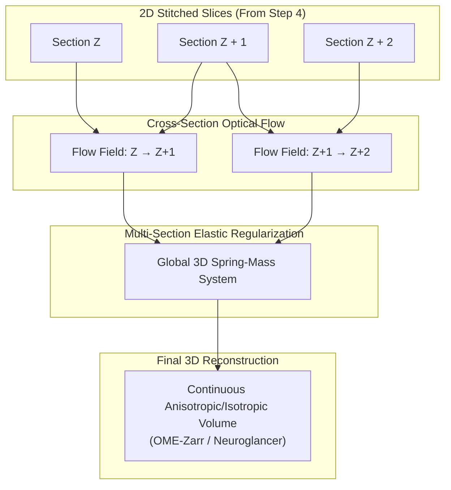

# 5. Section Fine-Alignment (Roadmap)

The final phase in Serial Block-Face image processing is **Section Fine-Alignment (Z-Axis)**. While Step 4 produces seamless 2D mosaics within each individual section, reconstructing an isotropic 3D volume requires establishing continuous spatial correspondence across thousands of physical cutting planes.

> [!NOTE] Roadmap Notice
> **Tab 5 ("5. FINE ALIGNMENT")** is an active area of development. While the underlying mathematical engines (SOFIMA 3D flow fields and multi-section relaxation) are implemented in the computational core, the interactive GUI module shown in the navigation bar is scheduled for an upcoming release.

---

## The Physical Need for 3D Fine Alignment

In SBEM, physical cuts are made mechanically by advancing an ultramicrotome knife across the block-face. This physical process introduces several 3D distortions:

1. **Cutting Compression & Friction**: The mechanical pressure of the knife shears and compresses the exposed tissue surface along the cutting direction. Consecutive sections often exhibit alternating expansion and compression.
2. **Thermal & Stage Creep Over Time**: Over weeks of imaging, long-term temperature fluctuations cause the specimen block to slowly rotate and shift relative to the optical column.
3. **Physical Section Thickness Variation**: Nominal microtome advances (e.g., $30\text{ nm}$) vary microscopically from stroke to stroke depending on specimen hardness and ambient humidity.

---

## Algorithmic Strategy (SOFIMA 3D)

The fine volumetric alignment pipeline operates through three mathematical stages:

### 1. Inter-Section Dense Optical Flow
Using SOFIMA's multi-scale patch matching, dense displacement fields are computed between section $Z$ and section $Z + 1$. Because anatomical structures (such as mitochondria, dendrites, and cell boundaries) span multiple 30 nm cuts, patch cross-correlation reliably resolves physical cutting deformations.

### 2. Multi-Section Elastic Spring Relaxation
Direct pairwise alignment causes cumulative drift (the "banana shape" curvature artifact across long volumes). To prevent this, the solver optimizes an elastic spring network across a multi-section window ($Z - k \dots Z + k$):
- **Intra-slice springs** maintain internal 2D structural integrity.
- **Inter-slice springs** minimize displacement vectors across multiple cutting planes.
- **Damping factors ($\gamma$)** prevent high-frequency oscillation during relaxation.

### 3. Volumetric Coordinate Transformation & Zarr Ingestion
The final relaxed 3D coordinates are used to resample all sections into a continuous coordinate frame, outputting multi-resolution **OME-Zarr** chunked arrays ready for petascale visualization in **Neuroglancer** or **MoBIE**.

---

## Upcoming GUI Features for Tab 5

When released, the interactive Tab 5 interface will feature:

- **Orthogonal Slicers ($XZ$ and $YZ$)**: Real-time virtual reslicing to visually inspect continuity along the cutting direction.
- **Inter-Section Flow Vector Visualizer**: Color-coded vector plots highlighting cutting shear and localized compression.
- **Drift Removal Controls**: Interactive constraints to lock anatomical landmarks and eliminate low-frequency volume curvature.

---

## References

- **SOFIMA**: Januszewski, M., Blakely, T., & Lueckmann, J.-M. (2024). *SOFIMA: Scalable Optical Flow-based Image Montaging and Alignment* [Computer software]. Zenodo. [https://doi.org/10.5281/zenodo.10534541](https://doi.org/10.5281/zenodo.10534541) / [GitHub](https://github.com/google-research/sofima).
- **SBEMimage**: Benjamin Titze et al., *SBEMimage: Open-source acquisition software for serial block-face electron microscopy*, [SBEMimage Repository](https://github.com/SBEMimage/SBEMimage).
